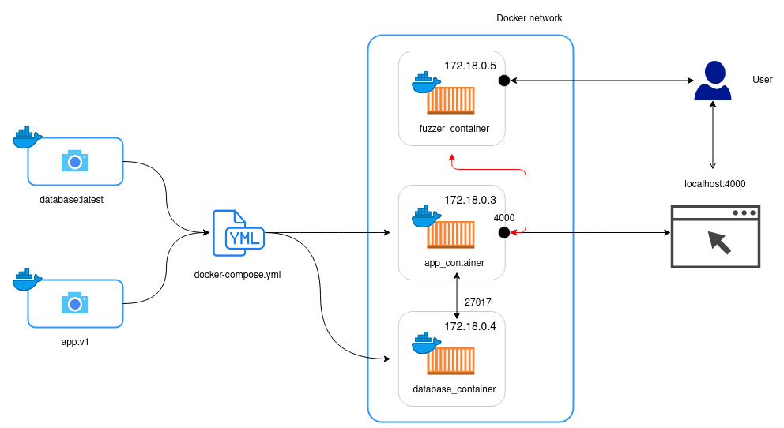

#### Copyright (c) 2020, 2021, Oracle and/or its affiliates.
#### Contributor: Trong Nhan Mai
---

# NODE_JS_FUZZING
A small project to compare the performance of various of fuzzers against 5 Node.js applications. The list of applications involved in this project:

- [NodeGoat v1.3.0](https://github.com/OWASP/NodeGoat/tree/v1.3) - [license](https://github.com/OWASP/NodeGoat/blob/v1.3/LICENSE)
- [Keystone v4.0.0](https://github.com/keystonejs/keystone-classic/tree/v4.0.0) - [license](https://github.com/keystonejs/keystone-classic/blob/v4.0.0/LICENSE)
- [Juice-Shop v8.3.0](https://github.com/bkimminich/juice-shop/tree/v8.3.0) - [license](https://github.com/bkimminich/juice-shop/blob/v8.3.0/LICENSE)
- [Mongo-express v0.51.0](https://github.com/mongo-express/mongo-express/tree/v0.51.0) - [license](https://github.com/mongo-express/mongo-express/tree/v0.51.0#license)
- [Apostrophe boilerplate](https://github.com/apostrophecms/apostrophe-boilerplate) - [license](https://github.com/apostrophecms/apostrophe-boilerplate/blob/main/LICENSE)

## Presequisites
The docker images are built and tested with:
- Docker version 18.09.1-ol, build b2a1f2a
- docker-compose version 1.27.4, build 40524192

All the docker-compose.yml files are at version "2.0". 
For the docker-compose version support, please see [here](https://docs.docker.com/compose/compose-file/compose-versioning/#version-2)

## Infrastructure


The infrastructure to exercise 5 Node.js applications has three components:
- Application Docker images
- Fuzzer Docker images
- Docker & docker-compose

With the help of `docker-compose.yml`, the infrastructure is started which allows fuzzer container to interact with our applications. The user can access both containers from the host machine.

## Building and pushing docker images to Github registry
First create a personal token on github. Make sure that the token has enough privileges (i.e read,write:packages). Then run docker login.

```
$ docker login docker.pkg.github.com --username <your_username> -p <your_token>
```

Build your image and run docker tag (all names are lowercase)
```
$ docker build -t <image_name>:<tag> .

$ docker tag <image_name>:<tag> docker.pkg.github.com/<user_name>/<repo_name>/<image_name>:<tag>
```

Push the tagged docker image to repo
```
$ docker push docker.pkg.github.com/<user_name>/<repo_name>/<image_name>:<tag>
```

For more information, please see [Github Docs](https://docs.github.com/en/free-pro-team@latest/packages/guides/configuring-docker-for-use-with-github-packages).

## Quick start
Docker-compose provides a quick and easy way to startup the applications.
1. Head to the desired application's directory (for example: `app_docker/nodegoat` for NodeGoat).
2. In the `docker-compose.yml` file, replace `<name>:<tag>` by the application's Docker image name. For example `nodegoat:v1`.
3. Run: `docker-compose up`
4. Docker-compose will handle the pulling and running those applications
5. Then you can access the application via browser on localhost. (Please see `README.md` in `app_docker` for more information).

*For apostrophe-boilerplate only*:
After the application has been started, we need to add an admin account. We do that by executing this command in the same directory with the `docker-compose.yml` file used:
```
$ docker-compose exec apostrophe node app apostrophe-users:add admin admin
``` 
The above command will add the user `admin` (first parameter) to the group `admin` (second parameter). After that you need to enter the password for this account (please use `demo` for admin to suit the auth script). Instructions taken from [here](https://github.com/apostrophecms/apostrophe-boilerplate#getting-started-with-docker).

## Further instructions
- Before using `docker-compose.yml` please provide it with the necesary image, or build your own following the instructions in [app_docker](app_docker/). 
- All the applications are run with code coverage enabled by default. To disable code coverage, in the `docker-compose.yml` file, remove the `--enable-coverage` (and `--babel` for JuiceS-Shop) flag in the startup `command`.
- The code coverage plugin uses a modified version of [instanbul-middleware](https://github.com/skyworld42/istanbul-middleware). The original repo is located [here](https://github.com/gotwarlost/istanbul-middleware) - [license](https://github.com/gotwarlost/istanbul-middleware/blob/master/LICENSE). 

## Authentication
We also provide authenticating scripts for each applications. The output of these scripts will be a set of tokens that can be used in the scanning process of fuzzers. Please refer to [README](auth/README.md) for how to use the scripts.